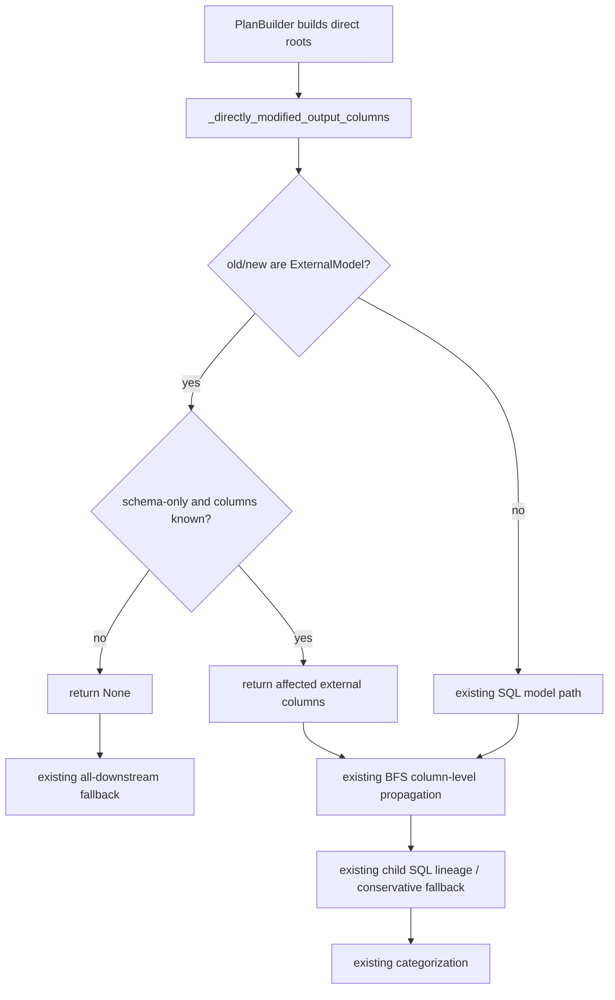

# external-model-column-impact design

## 0. 术语约定

| 术语 | 定义 | 防冲突结论 |
|---|---|---|
| External model | 由 `external_models.yaml` / `external_models/*.yaml` 加载出的 `ExternalModel`，表示 SQLMesh 项目外部表。 | 代码中已有 `ExternalModel` 类（`sqlmesh/core/model/definition.py`），本 feature 不改其身份语义。 |
| external schema diff | 新旧 external model 的 `columns_to_types` 对比结果，包含列新增、删除、类型变化、长度变化。 | 使用已加载后的 model schema，不直接 diff 原始 YAML。 |
| affected root columns | 直接变更的 external model 输出列集合，传给现有列级下游传播流程。 | 沿用 `PlanBuilder._directly_modified_output_columns` 的 tri-state contract。 |
| column-level downstream impact | 只让依赖受影响字段的 SQL 下游进入 indirect modified；无法证明时保守全量传播。 | 与已有 SQL model 列级传播测试同一概念，不新增一套 lineage 系统。 |

## 1. 决策与约束

### 输入基线对齐

- 结果：`aligned`。
- Requirement：无现有 req；这是内部 plan/snapshot 能力增强，不新增用户可见产品能力，按 `.cyralis/reference/cs-req` 允许没有 requirement。
- Architecture：`.cyralis/architecture/ARCHITECTURE.md` 仍是骨架，无可约束的现状 doc；以代码为当前权威。
- Compound：`.cyralis/compound` 为空；没有相关 decision / convention / explore。
- 代码证据：
  - `sqlmesh/core/loader.py:314-389` 已负责加载 external model YAML，并实例化 `ExternalModel`。
  - `sqlmesh/core/model/definition.py:1124-1152` 已把 `columns_to_types_` 纳入 model `data_hash`。
  - `sqlmesh/core/snapshot/definition.py:1861-1904` 通过 parent data hash 让下游 fingerprint 感知父节点数据变化。
  - `sqlmesh/core/plan/builder.py:490-536` 构建 direct / indirect modified 集合；`affected_columns is None` 时保守传播全部下游。
  - `sqlmesh/core/plan/builder.py:587-643` 目前只对 SQL model 计算直接变更输出列，external model 因 `is_sql == False` 直接退回 `None`。
  - `tests/core/test_plan.py:1953-2218` 已覆盖 SQL model 的列级下游过滤、类型变化、`select *`、非 projection 使用场景。

### 需求摘要

- 做什么：当 `external_models.yaml` 里的字段类型 / 长度 / 增删发生变化时，如果可以证明变更只影响特定字段，就让已有 column lineage 只传播到用到相关字段的下游。
- 为谁：使用 SQLMesh external models 描述上游表 schema、并依赖 plan/apply 判断变更范围的项目维护者。
- 成功标准：external model 的单列 schema 变化不会再让只读取无关字段的 SQL 下游被标记为 indirect modified；相关字段消费者、`select *`、非 projection 依赖和未知 lineage 场景仍保守受影响。
- 明确不做：
  - 不把 `ExternalModel.is_sql` 改为 `True`。
  - 不在 plan 阶段查询 warehouse 真实表 schema。
  - 不直接 diff 原始 `external_models.yaml` 文本。
  - 不新增用户配置开关。
  - 不尝试让 Python / Seed / 非 SQL 下游具备精确列级 lineage。
  - 不改变 snapshot fingerprint 存储格式，不做 migration。
  - 不主动重写 `ExternalModel.is_breaking_change` 的直接变更分类语义。

### 复杂度档位

按“对外发布的库/服务”默认档位处理；偏离项：

- Compatibility = backward-compatible（偏离默认表未显式列出）：只增强 plan 的影响范围判断，保留无法证明时的 `None` fallback，不能造成 false negative。
- Determinism = deterministic：同一组 old/new snapshots 和 DAG 必须稳定产出同一 indirect modified 集合。
- Testability = tested：必须先写 failing tests，覆盖正常、边界和 fallback。

### 关键决策

1. Canonical owner 是 `sqlmesh/core/plan/builder.py`。
   - 原因：`PlanBuilder` 已拥有 direct-vs-indirect 传播和 affected columns tri-state contract；loader 只负责把 YAML 变成 model，snapshot 只负责 fingerprint。
   - 被拒方案：在 loader 层或 YAML 层记录 diff。拒绝原因是会绕开 gateway selection、model normalization 和 snapshot diff。
2. external model 不伪装成 SQL model。
   - 原因：external model 没有 renderable query；让 `is_sql=True` 会误导 query rendering / projection map 逻辑。
3. 只有能证明是 schema-only 的 external direct change 才返回列集合。
   - 原因：返回 `set[str]` 会缩小下游影响范围；任何非 schema 语义变化若被误判，会产生 false negative。
4. 对列顺序变化保持保守。
   - 原因：当前 affected-column set 无法表达“只影响 star / order-sensitive 消费者”；若 columns 名称类型相同但顺序变化，至少 `select *` 消费者可能受影响，保守标记所有列。

#### 架构完整性检查

- 不变量：column-level propagation 只能在“已知受影响列集合”时收窄；未知 / semantic / 非 SQL lineage 仍全量传播。
- canonical owner / contract：`PlanBuilder._directly_modified_output_columns` 返回 `None | set[str]`，不新增公开 API。
- 责任重叠：`ExternalModel` 负责 schema 数据和 breaking-change 判断；不把 downstream propagation 责任搬进 model 层。
- 该丢的假设：不能因为 external model 有 columns 就认为所有 external 变更都是 schema-only。
- 更高层承接点：已有 `_schema_changed_columns`、`_add_column_level_downstream`、`_downstream_columns_impacted_by_parent` 足够承接；不需要新模块。
- 旧路径 / fallback 退休条件：旧的 all-downstream fallback 保留；只在 schema-only external diff 这个窄场景被新分支替代。
- 证伪点：实现中若无法可靠剥离 columns 以判断 schema-only，则必须回退到 `None`，不能硬返回列集合。
- 结论：按当前设计推进，目标是内聚到 PlanBuilder 的小范围增强。

## 2. 名词与编排

### 2.1 名词层

#### 现状

- `ExternalModel`：定义在 `sqlmesh/core/model/definition.py:1973-1993`，`source_type="external"`，`depends_on` 为空，`is_sql` 继承 `_Model.is_sql == False`。
- `columns_to_types`：`ModelMeta.columns_to_types_` 在 `sqlmesh/core/model/meta.py:86-100` 用 `columns` alias 接收声明；`_Model.columns_to_types` 在 `sqlmesh/core/model/definition.py:873-885` 返回列名到 `exp.DataType` 的映射。
- `data_hash` 输入：`_Model._data_hash_values_no_sql` 在 `sqlmesh/core/model/definition.py:1124-1152` 将 `columns_to_types_` 中每个 column name 与 `column_type.sql(dialect=self.dialect)` 写入 data hash。
- `PlanBuilder` affected-column contract：`_build_directly_and_indirectly_modified` 在 `sqlmesh/core/plan/builder.py:511-531` 把 `_directly_modified_output_columns` 的返回值解释为：`None`=未知/语义变化全量传播，`set()`=direct-only，非空集合=列级传播。
- `_schema_changed_columns`：`sqlmesh/core/plan/builder.py:1233-1241` 已用 old/new `columns_to_types` 找出 schema 变化列。

#### 变化

- 在 `PlanBuilder` 内新增一个 internal external-root classifier（实现可命名为 `_directly_modified_external_output_columns` 或等价名称）。
- classifier 输入是 new/old snapshots 或 models，输出沿用 `t.Optional[t.Set[str]]`：
  - `None`：无法证明 schema-only，保守全量传播。
  - `set[str]`：external schema-only diff 对应的 normalized changed columns；可以为空，但仅限确认为 direct-only/no-op 的安全情况。
- external schema-only 判断基于已加载的 model 对象，不基于 YAML 文本：
  - old/new 都是 `ExternalModel`。
  - old/new 都有 `columns_to_types`。
  - 剥离 columns 后的 data-hash-affecting inputs 等价；否则返回 `None`。
  - physical property semantic / unknown change 继续走 `None`，复用或等价遵守现有 `_physical_property_change_category` 安全边界。
- changed columns 计算：
  - 类型 / 长度变化：使用 `_schema_changed_columns(old_columns, new_columns)`。
  - 新增 / 删除列：同上。
  - 列顺序变化但名称 / 类型集合相同：保守返回所有 columns。

#### 接口示例

```python
# 来源：sqlmesh/core/plan/builder.py _directly_modified_output_columns
# old external a: changed_col VARCHAR(32), stable_col INT, ds DATE
# new external a: changed_col VARCHAR(64), stable_col INT, ds DATE
_directly_modified_output_columns(a_snapshot_id) == {"changed_col"}
```

```python
# 来源：sqlmesh/core/plan/builder.py _directly_modified_output_columns
# old/new external a columns known, but gateway/stamp/other data-affecting field also changed
_directly_modified_output_columns(a_snapshot_id) is None
```

### 2.2 编排层



#### 现状

- `PlanBuilder._build_directly_and_indirectly_modified` 遍历 DAG，把 directly modified roots 与 indirectly modified candidates 分开。
- 对每个 direct root 调 `_directly_modified_output_columns`：
  - 返回 `None` 时，`dag.downstream(root)` 中所有 indirectly modified candidates 都被加入。
  - 返回列集合时，进入 `_add_column_level_downstream` BFS。
- `_downstream_columns_impacted_by_parent` 对 SQL child 计算输出列影响：
  - parent columns 未知则 child 全部输出受影响。
  - changed parent columns 出现在 child projection 外（如 `where` / `join`）则 child 全部输出受影响。
  - 否则用 `column_lineage` 判断每个 child 输出列依赖哪些 parent columns。
- external model 目前卡在 `_directly_modified_output_columns` 的 SQL-only guard：`not new.model.is_sql or not old.model.is_sql` 直接 `None`。

#### 变化

- `_directly_modified_output_columns` 先识别 external root：
  1. 如果 new/old 不是 model 或类型不一致，仍走现有 fallback。
  2. 如果 new/old 都是 external model，调用 external-root classifier。
  3. classifier 返回非 `None` 时，复用现有 `_add_column_level_downstream`。
  4. classifier 返回 `None` 时，行为与今天一致：全下游保守传播。
  5. 非 external root 继续走现有 SQL path，不改变 SQL model 行为。
- 不改 `_downstream_columns_impacted_by_parent` 的核心语义：external root 的 child 通常是 SQL model，child output columns 和 dependencies 仍由现有 SQL lineage 计算。
- 不改 categorization 编排：direct external snapshot 是否 `BREAKING` / `NON_BREAKING` 仍由 `categorize_change` + `ExternalModel.is_breaking_change` + config 决定；本 feature 只改变哪些下游进入 indirect modified。

#### 流程级约束

- 错误语义：任何 render、normalize、schema-only 判断异常都返回 `None`，不抛新用户错误，不扩大 plan 失败面。
- 幂等性：helper 只读 snapshot/model 数据，不产生状态写入。
- 顺序约束：external branch 必须在 SQL-only guard 前执行；SQL path 保持原顺序。
- 可观测点：测试断言 `plan.indirectly_modified` 和 downstream `change_category`，不需要新增日志。
- 安全边界：宁可 false positive（多传播）也不能 false negative（漏传播）。

### 2.3 挂载点清单

本 feature 不引入新的用户配置、CLI、公共 API、数据库 schema 或外部注册项；属于内部 plan 行为增强。

- `PlanBuilder` direct root impact classifier：`sqlmesh/core/plan/builder.py::_directly_modified_output_columns` — 修改内部决策分支。
- Plan regression tests：`tests/core/test_plan.py` column-level indirect modification 测试区 — 新增 external model 场景作为行为挂载点。

### 2.4 推进策略

1. 测试骨架：先在 PlanBuilder column-level 测试区写 external type/length change 的 failing test。
   - 退出信号：当前实现下测试失败，表现为无关字段下游仍被 indirect modified。
2. 编排骨架：在 direct root impact classifier 中接入 external model schema-only 分支，先覆盖单列 type/length diff。
   - 退出信号：external 单列类型/长度变化只传播到相关 SQL 下游。
3. 计算节点：补齐 schema-only 判断和 conservative fallback，覆盖 missing schema / non-column data change / physical property safety。
   - 退出信号：无法证明 schema-only 的 external change 仍全下游传播。
4. 边界节点：处理新增列、删除列、列顺序变化、`select *`、非 projection 使用、多跳 lineage。
   - 退出信号：对应测试全部按设计通过。
5. 回归验证：运行 focused PlanBuilder tests，确认既有 SQL column-level tests 未变。
   - 退出信号：新增 external tests 与既有 column-level plan tests 全部通过。

### 2.5 结构健康度与微重构

##### 评估

- compound convention：`.cyralis/compound` 无文档，未命中目录组织 / 命名 / 归属 convention。
- 文件级 — `sqlmesh/core/plan/builder.py`：约 1384 行，已偏大；但本次变更落在既有 PlanBuilder column-level propagation owner 中，新增职责与现有 `_directly_modified_output_columns` / `_schema_changed_columns` 同域，不构成新的 owner mismatch。预计改动 1-2 个 helper + 一个 branch，不需要先拆文件。
- 文件级 — `tests/core/test_plan.py`：约 4847 行，已很大；但既有 SQL column-level 测试集中在 `1953-2218` 附近，新 external 场景应相邻落位，避免跨文件重组影响测试发现性。
- 目录级 — `sqlmesh/core/plan/`：顶层 7 个文件，本次不新增文件。
- 目录级 — `tests/core/`：本次不新增文件。

##### 结论：不做

本 feature 不做微重构。理由：目标改动属于 `PlanBuilder` 现有 column-level propagation owner；拆分 `builder.py` 或 `test_plan.py` 会涉及模块职责重划，超出“只搬不改行为”的安全微重构边界，且会放大本 feature 风险。

##### 超出范围的观察

- `sqlmesh/core/plan/builder.py` 与 `tests/core/test_plan.py` 都已经偏大；后续如果继续扩展 plan 分类/传播规则，建议单独走 `cs-refactor` 评估是否抽出 column-impact helper 和对应测试模块。本 feature 不动。

## 3. 验收契约

### 关键场景清单

1. External 单列类型变化：old `changed_col INT` → new `changed_col BIGINT`，下游 B 只 select `stable_col`，下游 C select `changed_col` → `plan.indirectly_modified[root]` 只包含 C，B 为 `METADATA` 或不进入 effective indirect，C 为 indirect category。
2. External 单列长度变化：old `changed_col VARCHAR(32)` → new `changed_col VARCHAR(64)` → 只影响读取 `changed_col` 的下游。
3. External 新增列：new 增加 `new_col`，显式读取旧稳定列的下游不受 indirect 影响；`select *` 下游受 indirect 影响。
4. External 删除列：删除 `removed_col` → 读取该列的下游受影响；无关稳定列消费者不受影响。
5. 非 projection 依赖：下游 `select stable_col from a where changed_col > 0`，external `changed_col` 变化 → 该下游受影响，且其下游继续按 affected output columns 传播。
6. 多跳传播：external changed column 影响 B 的输出列，C 读取 B 的该输出列 → B 和 C 都受 indirect 影响。
7. Missing schema fallback：old 或 new external model 缺少 `columns_to_types` → 行为保持今天的 conservative all-downstream propagation。
8. Non-column data change fallback：external model columns 不变但存在其它 data-affecting 字段变化 → 行为保持 conservative all-downstream propagation。
9. 列顺序变化：同名同类型但顺序变化 → 至少 `select *` 下游受影响；实现无法表达 star-only 时保守把所有 columns 作为 affected。
10. SQL model 回归：既有 SQL column-level indirect modification tests 结果不变。

### 明确不做的反向核对项

- 代码中不应把 `ExternalModel.is_sql` 改为 `True`。
- 代码中不应新增读取 raw `external_models.yaml` 文本 diff 的 plan 逻辑。
- 代码中不应新增 plan-time warehouse schema 查询。
- 代码中不应新增用户配置开关来控制该行为。
- 代码中不应修改 snapshot fingerprint schema / migration。
- 测试不应要求 Python / Seed 下游列级精确过滤。

## 4. 与项目级架构文档的关系

- 这是 plan/snapshot 内部行为增强，系统级可见概念是“PlanBuilder 支持 external model schema-only diff 作为 column-level affected root columns”。
- 当前 architecture 目录只有骨架，acceptance 阶段建议至少更新 `.cyralis/architecture/ARCHITECTURE.md` 的核心概念 / 模块索引，记录 plan builder 的 column-level impact 规则；如后续 cs-arch backfill 已建立 plan 子系统文档，则写入对应 plan/snapshot 架构 doc。
- 不需要用户指南更新，除非实现后维护者希望在 external models 文档中说明更精确的 plan 影响范围。

## Design Self-Review

**Status:** Approved

**Blocking Issues:**
- None

**Advisory Notes:**
- 本 design 故意不生成 checklist；按 workflow，需要你整体 review 并确认后，才做 Checklist 压力检查、生成 `{slug}-checklist.yaml`，再 transition 到 implement。
- 由于仓库没有可用的 `developer` / `code-reviewer` 自定义 subagent，本 design 阶段使用可用的 Explore / Plan 代理做只读理解；实现阶段仍需遵守仓库要求：先写 failing tests，再实现，再做代码 review。
